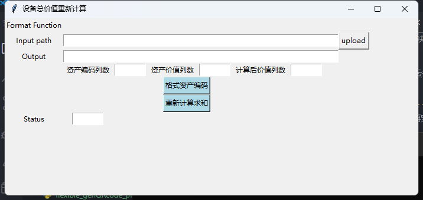
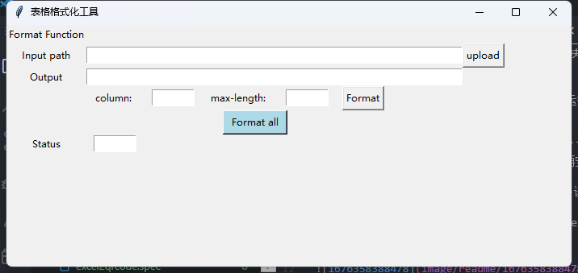

# 有关资产价值求和与数据格式化问题的解决方案
## 1. 有关资产价值求和
代码在本文档根目录下的'calc_sum.py'文件中，运行方式为：
```python calc_sum.py```

笔者目前环境在'requirements.txt'中，可使用```pip install -r requirements.txt```安装依赖。（但大多数为冗余依赖，可以尝试运行后再安装缺失的依赖）

当运行成功后，为了更好的在windows系统上进行多设备移植，可用pyinstaller将其打包为exe文件，运行方式为：
```pyinstaller -F calc_sum.py```，打包后的exe文件在dist目录下。

双击运行'calc_sum.exe',即可看到如下界面：


资产价值求和分为三个个步骤，第一步是将所有资产的资产编码统一格式化为12，第三步是求和。
在第一步和第三步之间，需要手动打开第一步生成的文件，将资产按照资产编码从小到大进行排序，然后保存，再进行第三步。

第一步，在`Input path`中输入资产价值文件的路径，在`Output`中输入输出文件的路径，点击`格式资产编码运行`。此过程会将所有资产的资产编码格式化为12位，然后将结果保存在`Output`中。`Output`非必填项，若不填，则默认在`Input path`的同级目录下生成一个`output.xlsx`文件。

第二步，打开第一步生成的文件，将资产按照资产编码从小到大进行排序，然后保存。

第三步，在`Input path`中输入第二步编辑的资产价值文件的路径，在`Output`中输入输出文件的路径，点击`求和运行`。此过程会将所有资产的资产价值求和，然后将结果保存在`Output`中。`Output`非必填项，若不填，则默认在`Input path`的同级目录下生成一个`output.xlsx`文件。

注：资产编码列数、资产价值列数、计算后价值列数非必填项，若不填，则默认为4、33、66。

## 2. 有关数据格式化问题
数据格式化是为了处理数据中不能被政府系统识别的字符，以及一些过长的数据，使其能够被政府系统识别。
代码在本文档根目录下的'format_data.py'文件中，运行方式为：
```python format.py```

同上，在运行成功后，可用pyinstaller将其打包为exe文件，运行方式为：
```pyinstaller -F format.py```，打包后的exe文件在dist目录下。

双击运行'format.exe',即可看到如下界面：


在`Input path`中输入需要格式化的数据文件的路径，在`Output`中输入输出文件的路径，点击`Format all`。此过程会将所有数据格式化，然后将结果保存在`Output`中。`Output`非必填项，若不填，**将直接覆盖之前的文件**（若文件较为重要，建议先备份）。

最大长度默认设置为15，超出15的数据将被截断，若需要修改默认最大长度，可在`format.py`文件中修改`maxlen`的值。

注：`column`、`max-length`为可选参数，`column`为需要格式化的列数，`max-length`为最大长度，点击`Format`按钮时，会将`column`列的数据格式化为`max-length`长度。

# 有关二维码打印的python文件

待续……